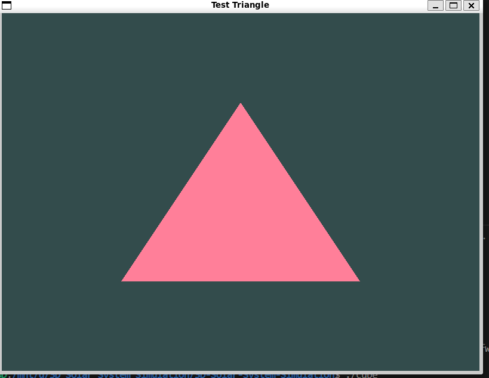
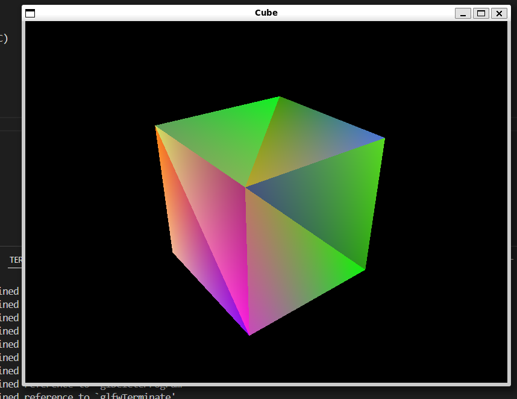
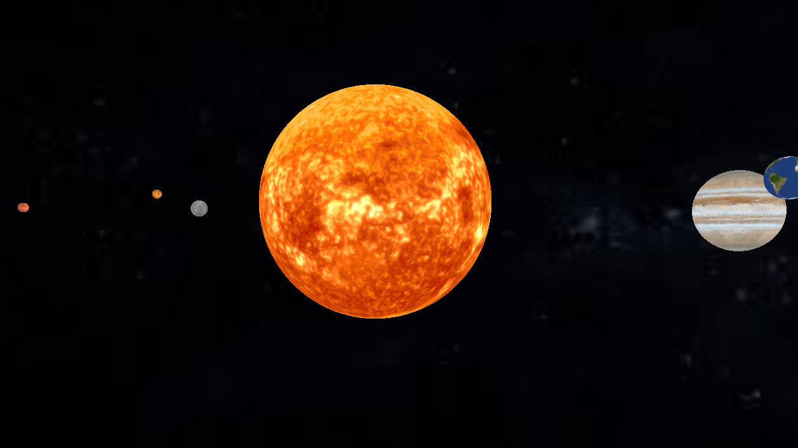

# 3D Solar System Simulation

A basic OpenGL application for simulating the solar system in 3D. You can move the camera with WASD keys and soon I will add the features to zoom in and zoom out.

## For Horizons reveiwer
I have submitted this project before to Flavortown before where it has 23 hours but it was just a basic project with just some triangle and monkey in it with no solar system. Now after Completing this Project to horizons and it has 87 hours now out of which 64 hours are now being reviewed by horizons.

## Prerequisites

- C++ compiler (GCC, Clang, or MSVC)
- CMake (version 3.10 or higher)
- OpenGL
- GLFW3
- GLEW

## Screenshots

### Triangle


### Cube



### Solar System



### Manual Installation
1. Download and install GLFW from https://www.glfw.org/
2. Download and install GLEW from http://glew.sourceforge.net/
3. Configure CMake with appropriate paths

## Building on Linux

```bash
# Install dependencies (Ubuntu/Debian)
sudo apt-get install libglfw3-dev libglew-dev

# Build
mkdir build
cd build
cmake ..
make
```

OR 

```bash
sudo apt-get install libglfw3-dev libglew-dev

g++ main.cpp Game.cpp Window.cpp ShaderProgram.cpp objload.cpp glad.c -o my_engine -I ./include -lglfw -lGL -ldl
./my-engine
````
## Running

```bash
./SolarSystem
```

## Controls

- **W**: Move Forward
- **A**: Move Left
- **S**: Move Backward
- **D**: Move Right
- **ESC**: Close the window
- **Arrow UP**: Zoom In (yet to add)
- **Arrow DOWN**: Zoom Out (yet to add)

## Current Status

All the Planets are Added and Solar System Simulation is working fine. You can Move around with the WASD Keys. yet to add Zoom In and Zoom Out features with Arrow Keys.